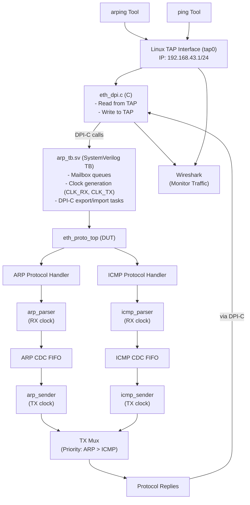

# Ethernet Protocol Handler (ARP + ICMP) DPI Project
## Author

**Artem Voropaev**  
Email: voropaev.art@gmail.com  
Created: 2025-11-06


## Functional Description

This project implements a **multi-protocol Ethernet handler (ARP + ICMP)** in SystemVerilog RTL that interfaces with a real Linux network stack using SystemVerilog DPI-C (Direct Programming Interface for C). The design can respond to real ARP requests and ICMP ping requests from the network through a TAP (network tap) interface.

### Key Features:
- **Multi-Protocol Support**: Handles both ARP (Address Resolution Protocol) and ICMP (Internet Control Message Protocol - ping)
- **Generic Protocol Framework**: Modular parser and sender modules that can work with any Ethernet protocol through SystemVerilog interfaces
- **Protocol-Specific Handlers**:
  - **ARP**: Responds to ARP requests with appropriate ARP replies
  - **ICMP**: Responds to ping (echo request) with echo replies
- **TX Multiplexer**: Arbitrates between multiple protocol transmitters (ARP has priority over ICMP)
- **Clock Domain Crossing**: Dual-clock FIFOs for safe transfer of protocol packets between RX and TX clock domains
- **TAP Interface Integration**: Connects RTL simulation to Linux TAP interface for real network packet exchange
- **DPI-C Bridge**: Provides seamless communication between SystemVerilog testbench and C code for packet handling

### How It Works:

1. A TAP interface (`tap0`) is created on the Linux host with IP address 192.168.43.1/24
2. The C application (`eth_dpi`) reads packets from the TAP interface and forwards them to the RTL via DPI-C
3. The RTL (`eth_proto_top`) distributes incoming packets to both ARP and ICMP parsers:
   - **ARP path**: Parses ARP requests, validates them, crosses clock domains via FIFO, and generates ARP replies
   - **ICMP path**: Parses ICMP echo requests (ping), validates them, crosses clock domains via FIFO, and generates echo replies
4. A TX multiplexer arbitrates between ARP and ICMP senders (ARP has priority)
5. Protocol replies are sent back through the DPI-C interface to the TAP interface
6. Real network tools like `arping` and `ping` can communicate with the simulated hardware
7. All traffic can be monitored using Wireshark on the TAP interface

**Default Configuration:**
- DUT MAC Address: `00:11:22:33:44:55`
- DUT IP Address: `192.168.1.1` (0xC0A80101)
- TAP Interface: `tap0` at `192.168.43.1/24`

to change the configuration, edit the `arp_tb.sv` file:

```verilog
      my_mac  = 48'h001122334455;
      my_ipv4 = 32'hC0A80101; // 192.168.1.1
```
---

## File Structure

```
eth_dpi/
├── README.md                         # This file
├── run.sh                            # Main simulation runner script
│
├── scripts/
│   └── create_tap_iface.sh           # Script to create TAP network interface
│
├── src/
│   ├── rtl/                          # RTL source files
│   │   ├── eth_proto_top.sv          # Top module: Multi-protocol handler (ARP + ICMP)
│   │   ├── eth_proto_parser.sv       # Generic protocol parser module
│   │   ├── eth_proto_sender.sv       # Generic protocol sender module
│   │   ├── dc_fifo_wrapper.sv        # Dual-clock FIFO wrapper for CDC
│   │   ├── altera_mf.v               # Altera megafunction library (FIFO implementation)
│   │   │
│   │   ├── proto_arp/                # ARP protocol implementation
│   │   │   ├── arp_if.sv             # ARP interface: frame structure, validation, reply generation
│   │   │   └── arp_top.sv            # ARP top module: parser + CDC FIFO + sender
│   │   │
│   │   └── proto_icmp/               # ICMP protocol implementation
│   │       ├── icmp_if.sv            # ICMP interface: frame structure, checksum, validation, reply
│   │       └── icmp_top.sv           # ICMP top module: parser + CDC FIFO + sender
│   │
│   └── tb/                           # Testbench files
│       ├── arp_tb.sv                 # Top-level testbench with DPI-C integration
│       ├── start_sim.tcl             # QuestaSim simulation script
│       ├── wave.do                   # Waveform configuration
│       ├── work/                     # QuestaSim work library (generated)
│       └── alt_verilog_libs/         # Compiled Altera libraries (generated)
│
└── sw/                               # Software/C code for DPI-C
    ├── eth_dpi.c                     # Main BFM: TAP interface handler
    ├── eth_dpi.h                     # DPI-C task declarations
    ├── Makefile                      # Builds shared library for DPI
    └── eth_dpi.so                    # Compiled shared library (generated)
```

### Key Files Description:

**RTL Files:**
- `eth_proto_top.sv`: Top-level module that instantiates ARP and ICMP handlers with TX multiplexer
- `eth_proto_parser.sv`: Generic parameterized parser for any protocol (used by both ARP and ICMP)
- `eth_proto_sender.sv`: Generic parameterized sender for any protocol (used by both ARP and ICMP)
- `dc_fifo_wrapper.sv`: Clock domain crossing FIFO wrapper for Altera megafunctions

**ARP Protocol Files:**
- `arp_if.sv`: ARP interface defining frame structure, validation functions, and reply packet generation
- `arp_top.sv`: ARP handler integrating generic parser, CDC FIFO, and generic sender

**ICMP Protocol Files:**
- `icmp_if.sv`: ICMP interface defining frame structure (Ethernet + IP + ICMP), checksum calculation, validation, and reply generation
- `icmp_top.sv`: ICMP handler integrating generic parser, CDC FIFO, and generic sender

**Testbench Files:**
- `arp_tb.sv`: SystemVerilog testbench with mailbox-based packet queues and DPI-C exports/imports
- `start_sim.tcl`: Compiles RTL and testbench, starts simulation with DPI-C library

**Software Files:**
- `eth_dpi.c`: Creates TAP interface, reads/writes packets, interfaces with RTL via DPI-C tasks
- `eth_dpi.h`: Header with DPI-C function declarations for SystemVerilog-C interface

---

## Tools Used
1. **Ubuntu 18.04**

2. **QuestaSim/ModelSim v2021.2** 

3. **gcc 7.5.0** (C/C++ Compiler)
   - Compiles C code into shared library (`.so`) for DPI-C interface

4. **GNU Make 4.1**
   - Builds the DPI-C shared library from C sources

5. **Linux Kernel TUN/TAP Driver**
   - Creates virtual network interface for packet injection/capture
   - Requires `/dev/net/tun` device

6. **arping** (from `iputils` package)
   - Command-line tool to send ARP requests
   - Used to test the ARP responder: `arping -I tap0 192.168.1.1`

7. **Wireshark 2.6.10** 
   - Network protocol analyzer for capturing and analyzing packets

---

## How to Run Simulation

### Prerequisites

### **Install Required Packages:**
   - Install arping
```bash
sudo apt-get install arping
```
   - Install Wireshark
```bash
sudo add-apt-repository ppa:wireshark-dev/stable
sudo apt-get update
sudo apt-get install wireshark
```


### **Update QuestaSim Paths:**

Edit `run.sh` to set your QuestaSim installation path:
```bash
export MSIM_HOME=/home/vae/Questa_sim/questasim
export LM_LICENSE_FILE=/home/vae/Questa_sim/license.dat
```

### **Create Linux TAP Interface:**

**Important:** TAP interface creation requires root privileges.

```bash
# Make the script executable
chmod +x scripts/create_tap_iface.sh

# Create TAP interface with IP 192.168.43.1/24
sudo ./scripts/create_tap_iface.sh
```
This script will:
- Create a TAP interface named `tap0`
- Assign IP address `192.168.43.1/24` to it
- Configure reverse path filtering
- Bring the interface up

### **Verify the interface:**
```bash
ifconfig tap0
```

You should see:
```
tap0: flags=4099<UP,BROADCAST,MULTICAST>  mtu 1500
        inet 192.168.43.1  netmask 255.255.255.0  broadcast 192.168.43.255
        ether e6:07:6f:82:09:1b  txqueuelen 1000  (Ethernet)
        RX packets 0  bytes 0 (0.0 B)
        RX errors 0  dropped 0  overruns 0  frame 0
        TX packets 0  bytes 0 (0.0 B)
        TX errors 0  dropped 0 overruns 0  carrier 0  collisions 0

```

### **Run QuestaSim Simulation:**

**Important**: run the simulation with sudo privileges.

```bash
# Make the script executable
chmod +x run.sh
```

Run the simulation in **console mode** (no GUI):
```bash
sudo ./run.sh
```

Or run with **GUI** for waveform viewing:
```bash
sudo ./run.sh -gui
```

**What happens during simulation:**
1. The `Makefile` compiles `eth_dpi.c` into `eth_dpi.so` shared library
2. QuestaSim compiles RTL and testbench files
3. Simulation starts and the C application opens the `tap0` interface
4. The testbench enters an infinite loop, waiting for packets from the TAP interface
5. You should see: `HOST: ifr_name=tap0, ready`

**Note:** The simulation runs indefinitely (does not auto-terminate). You'll need to stop it manually or it will run until packets are exchanged.

### **Test ARP with arping**

**In a separate terminal**, while the simulation is running, send ARP requests:

```bash
# Send ARP request to the DUT's IP address (192.168.1.1) via tap0
sudo arping -I tap0 192.168.1.1
```

**Expected Output:**
```
sudo arping -I tap0 192.168.1.1
ARPING 192.168.1.1
42 bytes from 00:11:22:33:44:55 (192.168.1.1): index=0 time=7.158 msec
42 bytes from 00:11:22:33:44:55 (192.168.1.1): index=1 time=5.262 msec
42 bytes from 00:11:22:33:44:55 (192.168.1.1): index=2 time=10.202 msec
42 bytes from 00:11:22:33:44:55 (192.168.1.1): index=3 time=4.356 msec

...
```

**In the QuestaSim console**, you should see:
```
# HOST: TAP-RD: nread=058
# ff ff ff ff ff ff e6 07 6f 82 09 1b 08 06 00 01 
# 08 00 06 04 00 01 e6 07 6f 82 09 1b c0 a8 2b 01 
# 00 00 00 00 00 00 c0 a8 01 01 00 00 00 00 00 00 
# 00 00 00 00 00 00 00 00 00 00 
# [            25224004] RX: Got packet;  sz =   58
# [            25224780] TX: Packets in store=    1
# [            25224780] TX: Sent packet; sz =   42

```

### **Test ICMP (Ping)**

**In a separate terminal**, while the simulation is running, send ping requests:

```bash
# Ping the DUT's IP address (192.168.1.1)
ping -I tap0 192.168.1.1
```

**Expected Output:**
```
ping -I tap0 192.168.1.1
PING 192.168.1.1 (192.168.1.1) from 192.168.43.1 tap0: 56(84) bytes of data.
64 bytes from 192.168.1.1: icmp_seq=1 ttl=64 time=8.23 ms
64 bytes from 192.168.1.1: icmp_seq=2 ttl=64 time=6.45 ms
64 bytes from 192.168.1.1: icmp_seq=3 ttl=64 time=7.89 ms
64 bytes from 192.168.1.1: icmp_seq=4 ttl=64 time=5.67 ms

--- 192.168.1.1 ping statistics ---
4 packets transmitted, 4 received, 0% packet loss, time 3005ms
rtt min/avg/max/mdev = 5.670/7.060/8.230/1.012 ms
```

**In the QuestaSim console**, you should see ICMP packets being processed:
```
# HOST: TAP-RD: nread=098
# 00 11 22 33 44 55 e6 07 6f 82 09 1b 08 00 45 00 
# 00 54 a1 2c 40 00 40 01 9f 7e c0 a8 2b 01 c0 a8 
# 01 01 08 00 d8 3e 12 34 00 01 ...
# [            35678912] RX: Got packet;  sz =   98
# [            35679688] TX: Packets in store=    1
# [            35679688] TX: Sent packet; sz =   98
```

### **Monitor Traffic with Wireshark**

**In another terminal**, launch Wireshark to observe packet exchange:

## Sim results:


